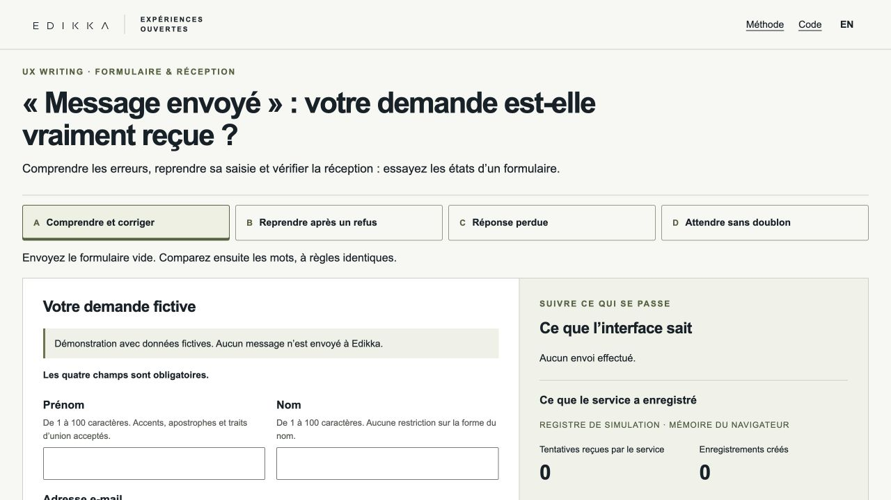

# « Message envoyé » : votre demande est-elle vraiment reçue ?

[Essayer en français](https://edikkaweb.github.io/accessible-form-demo/) · [Try in English](https://edikkaweb.github.io/accessible-form-demo/index-en.html) · [Reproduire / reproduce](docs/REPRODUCTION.md)

Une démonstration Edikka du **Protocole UX writing**, prolongée par un laboratoire de réception HTTP. Comparez des formulations à comportement identique, corrigez sans perdre votre saisie et vérifiez une réception incertaine.

**Exemple central :** le service enregistre une demande, mais sa réponse disparaît. Le formulaire affiche d’abord une incertitude. « Vérifier la réception » retrouve la référence ; une reprise avec la même clé ne crée pas de deuxième enregistrement.



## Essayer

- **A · Comprendre et corriger.** Formulaire vide, quatre erreurs puis une, messages synchronisés. Un contre-exemple rédactionnel conserve exactement les mêmes règles, associations et actions.
- **B · Reprendre après un refus.** Première tentative valide refusée avant stockage, reprise possible.
- **C · Réponse perdue.** Enregistrement effectué, résultat inconnu côté interface, vérification explicite.
- **D · Attendre sans doublon.** Délai déclaré de quatre secondes, activations répétées protégées, reprise sous la même référence.

[Ouvrir directement le scénario C](https://edikkaweb.github.io/accessible-form-demo/#scenario=C).

Les valeurs restent en mémoire. Sur **GitHub Pages**, elles ne quittent jamais le navigateur : aucun service de réception, télémétrie de saisie, compte, modèle ou CMS. Le registre est explicitement une simulation. **Aucun message n’est envoyé à Edikka.**

Dans le **laboratoire HTTP**, la même interface contacte uniquement un serveur sur `127.0.0.1`. Le stockage est en mémoire jusqu’à l’arrêt ; il n’est pas durable. Aucun e-mail ni CRM. Le scénario C coupe réellement une réponse HTTP incomplète après stockage. Le simulateur public ne prétend pas provoquer cette panne réseau réelle.

## Lancer et vérifier

Node.js **22 ou supérieur**, aucune dépendance d’exécution ni installation nécessaire.

```sh
npm run verify
npm test
npm run build
npm run preview     # http://127.0.0.1:4187/accessible-form-demo/
npm run lab         # http://127.0.0.1:4188/accessible-form-demo/
npm run test:historical
```

`npm test` construit automatiquement les fichiers statiques avant les contrôles, y compris après un clone neuf.

`EDIKKA_DEMO_PORT` permet de choisir un port. `npm run import` est une opération réseau explicite : il refuse d’écraser un original dont les octets auraient changé. Le fonctionnement normal n’utilise que les fichiers embarqués.

[Publication vérifiée / verified publication](docs/DEPLOYMENT.md) · [Bibliothèque : six expériences](https://www.edikka.com/bibliotheque#github-lab)

## Preuves et limites

**28 tests automatisés réussis**, y compris contrats navigateur/HTTP, concurrence réelle, conflit, annulation d’attente, reprise et confidentialité des exports. Recette manuelle dans le navigateur intégré Codex : quatre parcours, clavier, FR/EN, largeurs 1440/390, lien profond et scripts bloqués. Les détails datés et les limites figurent dans la [matrice attendu/observé](docs/VERIFICATION.md).

Les DOM et tests automatisés ne prouvent pas une annonce entendue. VoiceOver/Safari, NVDA/Firefox et étude avec participants restent **non testés**. Aucun gain de conversion ou conformité globale n’est revendiqué.

L’archive originale UX writing **1.0.1** reste inchangée. UXW07–08 documentent deux corrections rédactionnelles ; UXW09–12 étaient déjà satisfaits. UXW06 concerne une autre interface et reste « À tester ». La nouvelle démo possède ses propres identifiants **AFD** : [correspondance historique](docs/UXW-MAPPING.md).

## Architecture et documentation

- [`src/contract.mjs`](src/contract.mjs) : validation partagée et représentation canonique des quatre champs.
- [`src/service.mjs`](src/service.mjs) : réservation atomique par clé, registre et scénarios.
- [`src/controller.mjs`](src/controller.mjs) : états de l’interface, instantané et garde contre les résultats tardifs.
- [`src/transports.mjs`](src/transports.mjs) : adaptateurs mémoire et HTTP ; le journal pédagogique ne décide jamais du succès.
- [`src/server.mjs`](src/server.mjs) : serveur local, limite de taille, validation indépendante, origines et fichiers autorisés.
- [`docs/CONTRACT.md`](docs/CONTRACT.md) : transitions, HTTP, concurrence et limites.
- [`docs/PROVENANCE.md`](docs/PROVENANCE.md) : dates, versions, SHA-256 et licences.

[Instrument Edikka](https://www.edikka.com/bibliotheque#instrument-ux-writing-protocol) · [Article UX writing](https://www.edikka.com/insights/ux-ui-design/ux-writing-interfaces-claires) · [Article formulaire](https://www.edikka.com/insights/developpement-web/formulaire-accessible-erreurs-contacts-perdus)

## English

**“Message sent”: was your request actually received?**

[Open the English demo](https://edikkaweb.github.io/accessible-form-demo/index-en.html). Four scenarios explore correction, a confirmed pre-storage refusal, a lost response and delayed processing without duplicates. The reference wording and teaching counterexample share the same validation, focus and field associations. An opaque key belongs to a frozen business-data snapshot; a changed payload under that key is a conflict.

The public app is a **local browser simulation**. No entered value is sent anywhere. The optional HTTP lab binds to `127.0.0.1`, records only in memory and actually interrupts a partial response after recording. Only a completed, valid response can establish receipt. The teaching inspector’s knowledge cannot secretly approve the form’s state.

Use the commands above with Node 22+. JSON evidence excludes field values and their fingerprints; share links contain only a language and public scenario. [Reproduction](docs/REPRODUCTION.md), [state/HTTP contract](docs/CONTRACT.md), [verification matrix](docs/VERIFICATION.md) and [provenance](docs/PROVENANCE.md) distinguish observed results, historical sources and unperformed checks.

28 automated tests passed; desktop/mobile keyboard and local HTTP browser observations are documented. Screen-reader listening, participant studies, global conformance and conversion effects have **not** been established. Historical UXW06 remains untested, outside this form’s scope.

## Licences

New code, new copy and tests: [MIT](LICENSE). Original UX writing resources retain **CC BY 4.0**, Edikka / Bertrand Morel. No explicit licence was found in the four historical form-lab files: they are preserved as attributed originals and **excluded from the MIT grant**. See [provenance and adaptations](docs/PROVENANCE.md).

[Contribuer / Contributing](CONTRIBUTING.md) · [Toutes les démonstrations / All experiments](https://edikkaweb.github.io/)

La détection automatique de GitHub peut afficher « Other » : le fichier LICENSE conserve les exclusions des archives, composants tiers et marques. Le code original reste sous MIT dans le périmètre indiqué. / GitHub may show “Other”; the existing licence scopes and exclusions remain authoritative.
