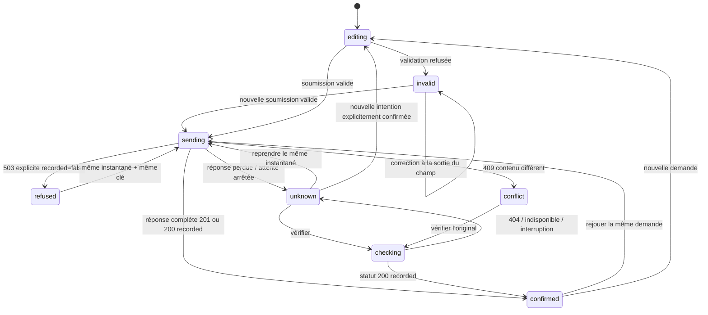

# États et contrat / States and contract · 1.0.0

Le protocole UX writing gouverne la précision des messages. Les contrôles de transport **AFD-R** constituent un prolongement distinct, pas une réévaluation des statuts UXW historiques.

## Trois responsabilités

`controller` conserve la saisie, l’instantané, la clé et l’état connu par l’interface. `transport` retourne une réponse valide ou une exception. `service` gère les réservations et le registre. Son journal pédagogique est une voie de lecture distincte ; il ne déclenche aucune transition de confirmation.

`editing`, `invalid`, `sending`, `refused`, `unknown`, `checking`, `confirmed`, `conflict` sont des états de formulaire, distincts d’un code HTTP ou du contenu du registre.

Une exception réseau ne prouve pas l’absence d’enregistrement. Un résultat `not_found_at_check` ne l’établit pas davantage : une requête peut être en cours. Le message reste incertain et propose vérification ou reprise de la même demande. Une vérification indisponible/perdue conserve l’incertitude. Aucun HTTP 200 incomplet ou JSON non exploitable ne confirme la réception.

Arrêter l’attente annule le `fetch` côté client, pas le traitement serveur déjà commencé. Un numéro d’opération et une génération de scénario empêchent l’ancien résultat de changer le nouveau formulaire. Les événements d’un ancien registre sont aussi écartés après réinitialisation. Aucun retour tardif ne déplace le focus.

## Données métier et clé

Quatre champs uniquement : `firstName`, `lastName`, `email`, `request`. Canonicalisation : ordre fixe, chaînes Unicode NFC, CRLF/CR normalisés en LF, espaces périphériques retirés, sérialisation JSON. Ni scénario, ni langue, ni variante rédactionnelle, ni identifiant d’interface n’appartiennent à ce contenu. L’e-mail n’est pas arbitrairement mis en minuscules.

Longueurs en points de code après normalisation : noms 1–100, e-mail 1–254, demande 10–2 000. Aucun filtre arbitraire sur accents, apostrophes, traits d’union ou alphabets. La syntaxe d’e-mail est un contrôle simple de forme, pas une vérification de boîte ou de livraison.

Une clé opaque est créée pour l’intention valide, puis gardée avec son instantané. Les champs deviennent en lecture seule tant que cette intention existe. Modifier la demande nécessite une action explicite de nouvelle intention ; dans un état incertain ou en cours, un dialogue rappelle qu’une autre clé peut produire un autre enregistrement.

Le service compare le contenu canonique avant toute réutilisation. Il réserve la clé **synchroniquement avant tout await**. Les requêtes concurrentes identiques attendent la même promesse. Un contenu différent produit immédiatement 409, même avant la fin du premier stockage. Protection dans un seul processus Node en mémoire, **pas** une transaction distribuée multi-serveurs.

## Contrat HTTP local

Serveur sur `127.0.0.1` uniquement. Chaque onglet utilise un UUID de session ; nouvelle demande/scénario = nouvelle session pédagogique. Les reprises gardent la même session et la même clé. Aucun identifiant, contact ou secret de production.

Toutes les API sont des POST JSON, cache `no-store` :

| Route          | Entrée                         | Réponse                                                                                                                                 |
| -------------- | ------------------------------ | --------------------------------------------------------------------------------------------------------------------------------------- |
| `/api/submit`  | session, key, fields, scenario | 201 première création `duplicate:false` ; 200 reprise `duplicate:true` ; 422 erreurs ; 503 refus explicite avant stockage ; 409 conflit |
| `/api/status`  | session, key, behavior         | 200 `status:recorded`, référence ; 404 `not_found_at_check` avec indication pending ; 503 indisponibilité ; interruption                |
| `/api/journal` | session                        | Décomptes, références et événements **sans valeurs ni empreintes de contenu**                                                           |

Les réponses de réception ne renvoient pas les champs. La lecture du journal ne confirme jamais l’interface. Le journal HTTP est un instantané actualisé en fin d’opération ou avec « Actualiser le registre pédagogique », pas un flux de surveillance permanent. Une réponse émise par le service n’est pas une preuve de réponse lue par l’interface.

Corps limité à 16 384 octets, JSON invalide 400, type de contenu incorrect 415, hôte/origine hors périmètre 403, 100 sessions et 500 tentatives par session au maximum (redémarrage pour vider). Routes inconnues 404. Les fichiers servis sont limités au manifeste de build ; code serveur et fichiers privés non servis. Le mode `--static` n’expose aucune API.

## Scénarios et contre-tests

| Cas | Règle publiée                                                                        | Résultat attendu                                                                 |
| --- | ------------------------------------------------------------------------------------ | -------------------------------------------------------------------------------- |
| A   | Validation identique pour les deux variantes                                         | 4 erreurs à vide, puis singulier ; saisie conservée ; correction possible        |
| B   | Première tentative valide d’une clé refusée avant réservation ; suivante autorisée   | 0 puis 1 enregistrement                                                          |
| C   | Première création enregistrée, puis réponse interrompue ; reprise servie normalement | unknown avant vérification ; même référence ; 1 enregistrement                   |
| D   | Délai de 4 000 ms avant stockage                                                     | attente visible, activations UI répétées ignorées ; reprise = 200 même référence |

Dans le simulateur, C rejette une promesse en mémoire. En HTTP, le serveur commence une réponse JSON volontairement incomplète, puis détruit la connexion. C’est une **coupure réelle après stockage**, pas un mock. Une première version fermait sans octet de réponse : le navigateur observé a repris automatiquement et reçu un succès idempotent. Le transfert interrompu empêche ce comportement de masquer le scénario. Les tests HTTP vérifient le rejet de la lecture du corps, le registre et la récupération.

Contre-tests avancés dans les détails : prochaine vérification indisponible, réponse perdue, ou résultat momentanément non trouvé (simulation d’un statut retardé). Le choix vaut une vérification puis revient à normal. Ils ne sont pas des observations de systèmes tiers. Le cas `network-before` est réservé aux tests de contrat : perte avant stockage. « Tester la même clé avec un autre contenu » ajoute un suffixe fictif au corps d’essai et doit produire un conflit.

## Accessibilité et annonces

Formulaire HTML natif, `novalidate`, labels et aides visibles. La validation commence à la soumission ; après échec, chaque champ est réévalué au blur. Aucune reconstruction du formulaire à chaque frappe. Le résumé est focalisé après la soumission invalide, avec des liens qui focalisent réellement les champs. Dans la référence, le même générateur fournit messages du résumé et messages inline. Dans le contre-exemple, seuls les mots du résumé changent.

Résumé sans `role=alert` ni région live : le focus est la stratégie retenue. Une seule région `role=status`, atomique, annonce les états asynchrones ; elle ne reçoit pas le focus et n’est pas réécrite à chaque frappe ou événement du journal. Le bouton en attente reste focalisable avec `aria-disabled=true` et une garde fonctionnelle, pour éviter la perte de focus. Le serveur protège indépendamment la concurrence.

`fieldset disabled`, bouton principal désactivé au build, `method=dialog` et CSP `form-action 'none'` empêchent un envoi natif en paramètres d’URL avant ou sans initialisation. Les handlers sont attachés avant activation. Le contenu explicatif existe dans le HTML initial.

## Confidentialité / Privacy

Public mode has no network transport, persistent storage or field telemetry. The public CSP forbids connections and native form submission. Free text is assigned only to native values/text nodes. Exports contain an allowlisted event history, opaque test identifiers, counts, versions and environment; **no field values or content fingerprints**. Links contain only the selected language and an allowlisted scenario. Reset discards the current session from the interface; a request already processing may still finish in an old local-server session until shutdown.

These controls establish bounded demo behaviour. They do not establish durable storage, email delivery, a production security assessment or global accessibility conformance.
